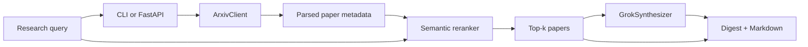

# 🔎 Research Scout

> **Ask a research question. Get a ranked, source-linked literature digest.**

Research Scout is a small retrieval agent for quickly exploring the arXiv literature. Give it an open-ended research query and it will:

1. Search arXiv for candidate papers.
2. Compare the query and papers with local embedding vectors.
3. Return the most semantically relevant papers.
4. Ask Grok to turn their abstracts into a structured research digest.

It is designed to make the first pass of a literature review faster while keeping every result traceable to its original arXiv page.

<p align="center">
  
  
  
  
</p>

## ✨ What it does

```text
Your research question
          │
          ▼
   arXiv candidate search ──────► broad recall
          │
          ▼
 Local sentence-transformer ───► semantic reranking
       embeddings
          │
          ▼
       Top-k papers ────────────► source-linked evidence
          │
          ▼
       Grok synthesis ──────────► structured digest
```

The arXiv search intentionally gathers a broad candidate set first. Embedding similarity then narrows it down based on meaning, rather than relying only on exact keyword overlap.

## 🧱 Architecture



### Main components

| Component | Responsibility |
| --- | --- |
| `arxiv.py` | Calls the arXiv API, parses Atom XML, removes duplicate IDs, and retries transient failures. |
| `ranking.py` | Embeds the query and paper title/abstract text, then ranks by cosine similarity. |
| `synthesis.py` | Sends selected paper context to Grok and validates the returned digest schema. |
| `pipeline.py` | Orchestrates retrieval → ranking → synthesis. |
| `api.py` | Exposes `POST /research` and `GET /health`. |
| `cli.py` | Provides a terminal-friendly interface with Markdown or JSON output. |
| `models.py` | Defines validated request, paper, digest, and response models. |

## 🚀 Quickstart

### 1. Create an environment

PowerShell:

```powershell
python -m venv .venv
.\.venv\Scripts\Activate.ps1
pip install -e ".[dev]"
```

macOS/Linux:

```bash
python3 -m venv .venv
source .venv/bin/activate
pip install -e ".[dev]"
```

### 2. Configure Grok

Create a local environment file:

```powershell
Copy-Item .env.example .env
```

Open `.env` and set your xAI key:

```dotenv
XAI_API_KEY=your_xai_api_key_here
```

> 🔐 Never commit `.env` or place API keys directly in source code.

### 3. Run your first research query

```powershell
research-scout "retrieval augmented generation evaluation" --top-k 5
```

The first run may take longer because the configured embedding model is downloaded locally. Later runs reuse the model cache.

## 🖥️ CLI usage

The CLI prints a readable Markdown digest by default:

```powershell
research-scout "mechanistic interpretability of language models" `
  --max-results 25 `
  --top-k 6
```

For automation, request the complete validated response as JSON:

```powershell
research-scout "diffusion models for protein design" --json-output > result.json
```

| Option | Default | Meaning |
| --- | ---: | --- |
| `query` | — | The research question or topic to investigate. |
| `--max-results` | `20` | Number of arXiv candidates to retrieve. |
| `--top-k` | `5` | Number of semantically ranked papers sent to synthesis. |
| `--json-output` | `false` | Prints machine-readable JSON instead of Markdown. |

## 🌐 API usage

Start the service:

```powershell
uvicorn research_scout.api:app --reload
```

Check that it is running:

```powershell
Invoke-RestMethod http://127.0.0.1:8000/health
```

Submit a research request:

```powershell
$body = @{
  query = "How are vision-language models evaluated for hallucination?"
  max_results = 20
  top_k = 5
} | ConvertTo-Json

Invoke-RestMethod `
  -Uri http://127.0.0.1:8000/research `
  -Method Post `
  -ContentType "application/json" `
  -Body $body
```

Equivalent `curl` request:

```bash
curl -X POST http://127.0.0.1:8000/research \
  -H "Content-Type: application/json" \
  -d '{"query":"transformer interpretability","max_results":20,"top_k":5}'
```

Interactive API documentation is available at [`/docs`](http://127.0.0.1:8000/docs) while the server is running.

## 📦 Response shape

Every successful response contains the original query, retrieval count, ranked papers, structured digest, and rendered Markdown:

```json
{
  "query": "transformer interpretability",
  "retrieved_count": 20,
  "papers": [
    {
      "arxiv_id": "2401.12345",
      "title": "Example paper",
      "abstract": "...",
      "authors": ["A. Researcher"],
      "categories": ["cs.AI"],
      "url": "https://arxiv.org/abs/2401.12345",
      "similarity": 0.8421
    }
  ],
  "digest": {
    "overview": "...",
    "key_findings": ["..."],
    "themes": ["..."],
    "limitations": ["..."],
    "paper_summaries": ["..."]
  },
  "markdown": "# Research Scout Digest..."
}
```

## ⚙️ Configuration

All settings can be placed in `.env` or supplied as environment variables.

| Variable | Default | Description |
| --- | --- | --- |
| `XAI_API_KEY` | — | Required for Grok synthesis. |
| `GROK_MODEL` | `grok-3-mini` | Grok model used for digest generation. |
| `EMBEDDING_MODEL` | `sentence-transformers/all-MiniLM-L6-v2` | Local sentence-transformer model. |
| `ARXIV_TIMEOUT_SECONDS` | `20` | HTTP timeout for arXiv requests. |
| `ARXIV_RETRIES` | `2` | Number of retry attempts after a request failure. |
| `DEFAULT_MAX_RESULTS` | `20` | Default candidate count. |
| `DEFAULT_TOP_K` | `5` | Default number of selected papers. |

## 🧪 Development

Run the test suite:

```powershell
pytest -q
```

Compile-check the package:

```powershell
python -m compileall research_scout tests
```

The tests use fake arXiv, embedding, and synthesis providers, so they do not require network access, a downloaded model, or an API key.

## 🗂️ Project layout

```text
research-scout/
├── research_scout/
│   ├── api.py          # FastAPI application
│   ├── arxiv.py        # arXiv retrieval and parsing
│   ├── cli.py          # CLI entry point
│   ├── config.py       # Environment-backed settings
│   ├── models.py       # Pydantic schemas
│   ├── pipeline.py     # End-to-end orchestration
│   ├── ranking.py      # Embedding-based ranking
│   └── synthesis.py    # Grok synthesis and Markdown rendering
├── tests/
├── .env.example
├── pyproject.toml
└── README.md
```

## ⚠️ Important limitations

- Retrieval currently uses arXiv keyword search; embeddings rerank only the retrieved candidates.
- Results are stateless and are not persisted between runs.
- Similarity scores indicate ranking relevance, not paper quality or scientific validity.
- Grok receives paper titles, abstracts, authors, and links—not full paper PDFs.
- The digest is an aid for discovery. Read the original papers before relying on a claim.

## 🔭 Possible next steps

- Add SQLite caching for repeated queries and paper metadata.
- Support PDF extraction for deeper evidence-grounded synthesis.
- Add query expansion and date/category filters.
- Add evaluation datasets for retrieval precision and digest faithfulness.
- Add a browser UI for comparing papers and exporting reports.
